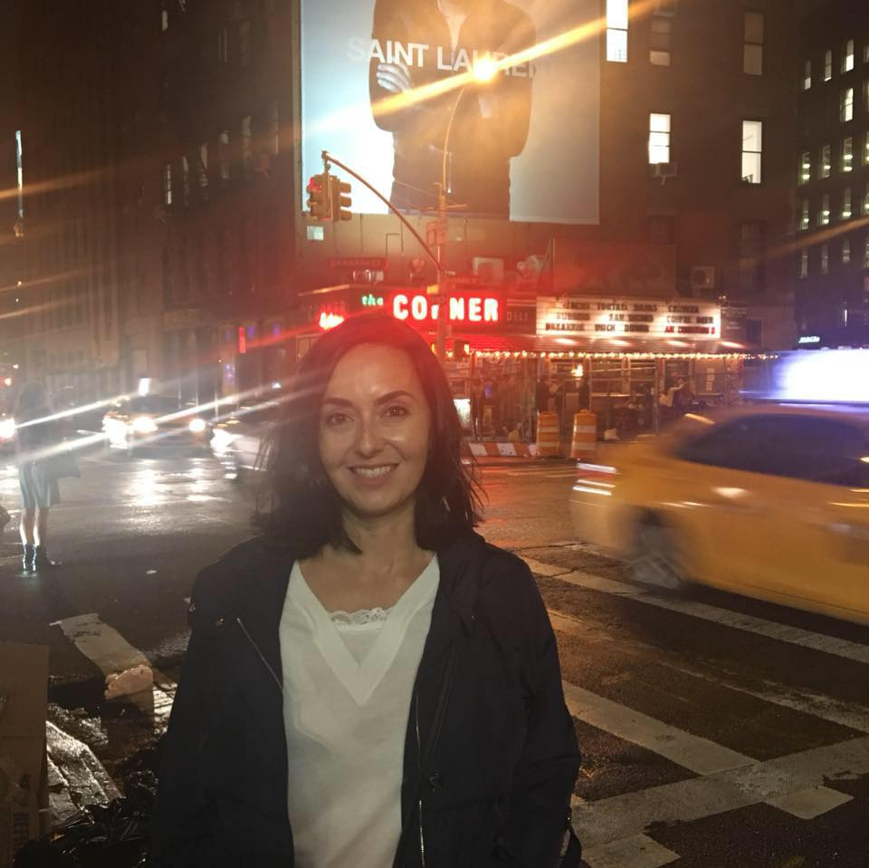

<!-- ======= About Section ======= -->
<section id="about" class="about section-bg">

  <h2>About me</h2>

  

    
  

  

As a seasoned translator with 17 years of experience, I work with companies to showcase their products and services, and to help them communicate effectively with their target audience. Although I have a Spanish name, my family relocated to the United States before I turned one, where I was raised in a bicultural setting. English is my mother tongue and I only translate from Spanish into English. Around my 30th birthday, I decided to leave Washington DC, my hometown, and move back to Europe. I settled down in Alicante because of the fantastic climate and slower-paced life, but I continue to travel regularly throughout Europe and the rest of the world.
 

Because I have a bilingual understanding of both Spanish and English, my translations are based on the intended message and not just the actual words. This is particularly important when building a brand and targeting specific segments. Having worked a number of years at SMEs and multinationals in the United States and Spain, I have experienced firsthand many of the challenges faced by businesses in their day-to-day operations.

  

    

      

        <i class="bx bx-receipt"></i>
        <h4>Degrees & Certificates:</h4>
        
-	University of Maryland (Maryland, USA). Bachelor’s degree in Business & Management (Marketing and International Business). December 1997.

        
-	Thomas S. Wootton High School (Maryland, USA). June 1994.

        
-	Robert Frost Middle School (Maryland, USA). June 1990.

        
-	Cedar Grove Elementary School (Maryland, USA). June 1988.

        
-	ProZ Spanish>English Certification [link a PDF]

      

      

        <i class="bx bx-cube-alt"></i>
        <h4>Software:</h4>
        
-	SDL Trados Studio 2015

        
-	Apsic Xbench for quality assurance

        
-	MS Office

      

      

        <h4>Downloads:</h4>
        
-	<a href="docs/AlmudenaGrau_english.pdf">CV in English</a>

        
-	<a href="docs/AlmudenaGrau_spanish.pdf">CV in Spanishz</a>

        
-	<a href="docs/ATA_Chronicle_2002%20March_pages_1_3_6_17.pdf">Article published in the ATA Chronicle. “Getting the Word Out.”</a>

      

    

</section><!-- End About Section -->