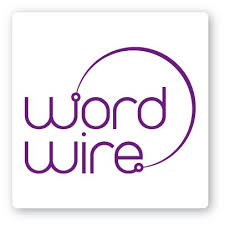

<!-- ======= Services Section ======= -->
<section id="services" class="services section-bg">

  <h2>Services</h2>
  <h4>Areas of expertise:</h4>

  

    

      <i class="icofont-computer"></i>
      <h4>Marketing and SEO</h4>
    

  

  

    

      <i class="icofont-chart-bar-graph"></i>
      <h4>eCommerce</h4>
    

  

  

    

      <i class="icofont-badge"></i>
      <h4>Public Relations</h4>
    

  

  

    

      <i class="icofont-settings"></i>
      <h4>Information Technology</h4>
    

  

  

    

      <i class="icofont-earth"></i>
      <h4>Health</h4>
    

  

  

    

      <i class="icofont-tasks-alt"></i>
      <h4>Babies & Children</h4>
    

  

  

    

      <i class="icofont-computer"></i>
      <h4>Cosmetics</h4>
    

  

  

    

      <i class="icofont-chart-bar-graph"></i>
      <h4>Fashion</h4>
    

  

  

    

      <i class="icofont-image"></i>
      <h4>Home décor</h4>
    

  

  

    

      <i class="icofont-settings"></i>
      <h4>Food & Dining</h4>
    

  

  

    

      <i class="icofont-earth"></i>
      <h4>Travel & Tourism</h4>
    

  

  

    

      <i class="icofont-tasks-alt"></i>
      <h4>Sports</h4>
    

  

</section><!-- End Services Section -->

<section id="what-we-do" class="what-we-do">
      

        

          <h2>Why invest in my services?</h2>
        

        

          

            

              
<i class="bx bxl-dribbble"></i>

              <h4>Image</h4>
              
You’ve worked hard to build your business and need a professional translation that is in line with the impeccable image you strive to convey. Sure, there are cheaper or even free alternatives, but at what cost to your reputation?

            

          

          

            

              
<i class="bx bx-file"></i>

              <h4>Reliability</h4>
              
I personally translate every word and nothing is outsourced. This ensures a consistent style and terminology, giving you peace of mind.

            

          

          

            

              
<i class="bx bx-tachometer"></i>

              <h4>Professionalism</h4>
              
When we agree on a deadline, that commitment is always met. I plan ahead accordingly so you can go about your business knowing that my translation will be delivered on time.

            

          

          

            

              
<i class="bx bxl-dribbble"></i>

              <h4>Quality assurance</h4>
              
Once I finish translating a document, it undergoes multiple revisions and QA tools to ensure a polished, error-free text, with the right wording and tone.

            

          

          

            

              
<i class="bx bx-file"></i>

              <h4>Terminology management</h4>
              
Certain industries and clients require specific terminology, which I carefully research to create glossaries and to ensure accurate translations for every target audience.

            

          

          

            

              
<i class="bx bx-tachometer"></i>

              <h4>Long-term partnerships</h4>
              
The longer we work together, the more I am able to understand your preferences and needs, and the better service I can offer.

            

          

        

      

</section>

<section id="about" class="about">
      

        

          <h2>Some of the companies I have translated for include:</h2>
        

        

          

            <ul>
              <li><i class="bx bx-check-double"></i>Barceló Hotel Group</li>
              <li><i class="bx bx-check-double"></i>BBVA</li>
              <li><i class="bx bx-check-double"></i>easyJet</li>
              <li><i class="bx bx-check-double"></i>eDreams</li>
              <li><i class="bx bx-check-double"></i>Fundación Exit</li>
              <li><i class="bx bx-check-double"></i>Ikea</li>
              <li><i class="bx bx-check-double"></i>Indra</li>
              <li><i class="bx bx-check-double"></i>Irizar</li>
              <li><i class="bx bx-check-double"></i>Lodi</li>
              <li><i class="bx bx-check-double"></i>Mustang</li>
            </ul>
          

          

            <ul>  
              <li><i class="bx bx-check-double"></i>Nae</li>
              <li><i class="bx bx-check-double"></i>Ordesa</li>
              <li><i class="bx bx-check-double"></i>Pepsi</li>
              <li><i class="bx bx-check-double"></i>Pikolinos</li>
              <li><i class="bx bx-check-double"></i>Room Mate Hotels</li>
              <li><i class="bx bx-check-double"></i>Seat</li>
              <li><i class="bx bx-check-double"></i>Servihabitat</li>
              <li><i class="bx bx-check-double"></i>Mount Teide Cable Car</li>
              <li><i class="bx bx-check-double"></i>Sanitas</li>
              <li><i class="bx bx-check-double"></i>Cruces University Hospital</li>
            </ul>
          
          
        

      

</section>

<!-- ======= Testimonials Section ======= -->
<section id="testimonials" class="testimonials section-bg">

  <h2>Testimonials</h2>

  

    

      <i class="bx bxs-quote-alt-left quote-icon-left"></i>
      Almudena has become one of our most reliable translators. She is really professional, respects deadlines, keeps the original format and is always reachable. We love her!<i class="bx bxs-quote-alt-right quote-icon-right"></i>
    

    
    <h3>Subbabel</h3>

  

  

    

      <i class="bx bxs-quote-alt-left quote-icon-left"></i>
      She is a hardworking, accurate and punctual translator. A++.
      <i class="bx bxs-quote-alt-right quote-icon-right"></i>
    

    
    <h3>Komalingua</h3>
  

  

    

      <i class="bx bxs-quote-alt-left quote-icon-left"></i>
      Her superior knowledge and practice accumulated throughout previous years and the skills acquired during our collaboration have developed in her a strong sense of confidence with a positive attitude.
      <i class="bx bxs-quote-alt-right quote-icon-right"></i>
    

    
    <h3>Indra BMB</h3>
  

  

    

      <i class="bx bxs-quote-alt-left quote-icon-left"></i>Outstanding translator. She's become one of my usual providers, definitely to be recommended!<i class="bx bxs-quote-alt-right quote-icon-right"></i>
    

    
    <h3>Wordwire</h3>
  

  

    

      <i class="bx bxs-quote-alt-left quote-icon-left"></i>An outstanding professional! It is a pleasure to find translators like Almudena, and we will continue working with her.<i class="bx bxs-quote-alt-right quote-icon-right"></i>
    

    
    <h3>Carma</h3>
  

  

    

      <i class="bx bxs-quote-alt-left quote-icon-left"></i>Very good quality and communication. Delivered as promised and was friendly and flexible at all times. Highly recommended.<i class="bx bxs-quote-alt-right quote-icon-right"></i>
    

    
    <h3>Trad Online</h3>
  

</section><!-- End Testimonials Section -->